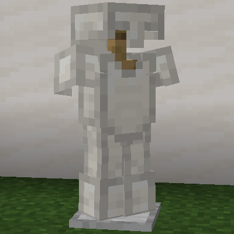
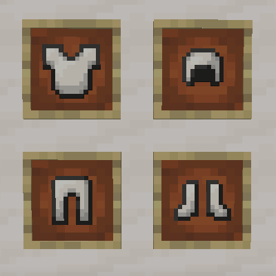

# Quartz Armor

A Fabric mod for Minecraft 1.21.11 that adds armor made from smooth quartz blocks.

## Features

Quartz armor offers the highest protection but breaks quickly.

### Armor Stats

| Stat | Quartz | Diamond |
|------|--------|---------|
| Helmet Defense | 4 | 3 |
| Chestplate Defense | 9 | 8 |
| Leggings Defense | 7 | 6 |
| Boots Defense | 4 | 3 |
| **Total Defense** | **24** | **20** |
| Armor Toughness | 3.0 | 2.0 |
| Base Durability | 10 | 33 |
| Enchantability | 30 | 10 |

**Highlights:**
- Highest protection in the game (+4 over diamond)
- Higher armor toughness than diamond
- Triple the enchantability of diamond
- Very low durability (breaks fast)
- Crafted from smooth quartz blocks

## Screenshots

## Crafting

Standard armor crafting patterns using **Smooth Quartz Blocks** instead of ingots.

## Installation

1. Install [Fabric Loader](https://fabricmc.net/use/) for Minecraft 1.21.11
2. Download and install [Fabric API](https://modrinth.com/mod/fabric-api)
3. Download the latest release of Quartz Armor
4. Place the jar file in your `mods` folder

### Server-Side Installation

This mod works on servers with vanilla clients! When installed on a server:
- Vanilla clients will be prompted to download a resource pack
- If accepted, they see custom armor textures
- If declined, armor appears as dyed leather but stats still work

Polymer is bundled with the mod - no additional downloads required.

## Requirements

- Minecraft 1.21.11
- Fabric Loader 0.18.1+
- Fabric API
- Polymer (bundled)

## License

This project is licensed under the MIT License - see the [LICENSE](LICENSE) file for details.
